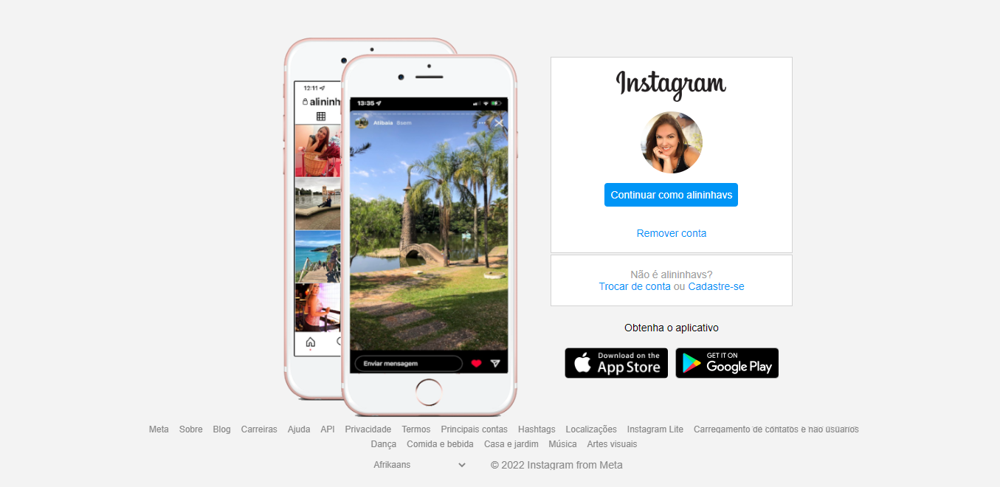

 

Interface Login Instagram

 

# Projeto

Bootcamp DIO Geração Tech Unimed-BH Fullstack - Criando uma interface do login do Instagram.

# Desafio:

Recrie a interface do login do Instagram utilizando CSS3 com Flexbox.

# O que foi utilizado:

* [HTML básico](https://www.w3schools.com/html/)
* [CSS básico](https://developer.mozilla.org/pt-BR/docs/Web/CSS)

# Funcionalidades:

* Layout Padrão
* CSS com Flexbox
* Responsivo

# Screenshots

